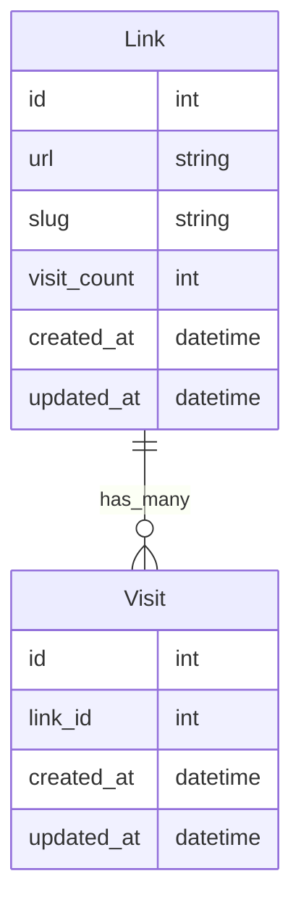

# GUS URL Shortener - API

This project is an Elixir/Phoenix application that provides the API for the URL shortener. It uses a Postgres database to store the URLs and the click data. It also provides an OpenAPI 3.0 spec that can be viewed at [http://localhost:4005/api](http://localhost:4005/api) once the project is up and running.

## Getting Started

See the [README](../README.md) in the root of the project for instructions on how to get the project up and running.

## Slug Generation

The slugs that are generated need to have the following characteristics:

- Unique
- Short
- URL-safe

The slugs are generated using `:crypto.strong_rand_bytes` to generate a uniformly distributed random string of bytes, which is then encoded using `Base.url_encode64/1` to create a URL-safe string. Further, string is stripped of non alpha-numeric characters for user-friendliness.

## API

The frontend is utilizing the following endpoints:

`GET /api/links` to list the links for the stats page

- In the future, it would be nice to add pagination to this endpoint so that we can limit the number of links returned at a time.

`POST /api/links` to create a new link with shortened URL slug.

`POST /api/links/:slug/visits` to create a visit record and increment the visit count for a link. The front end uses the `url` returned to redirect the user to the original URK.

- In the future, it would be nice to batch the writes so that we can reduce the number of writes to the database and increase throughput. It would also benefit from a caching layer such as ets or Redis to reduce the number of reads to the database.

## Entity Relationship Diagram

