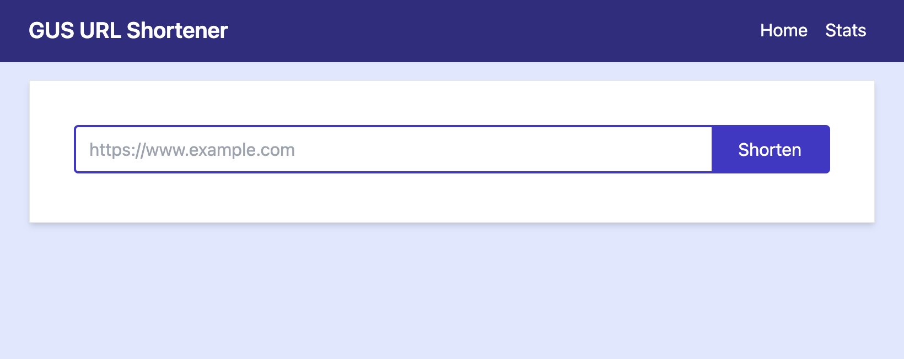
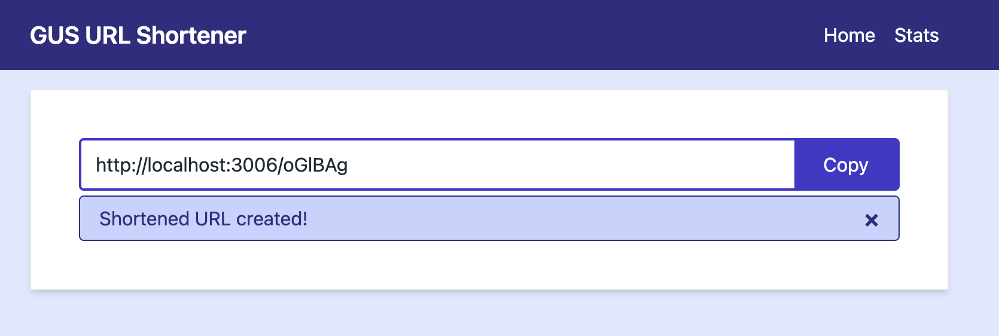
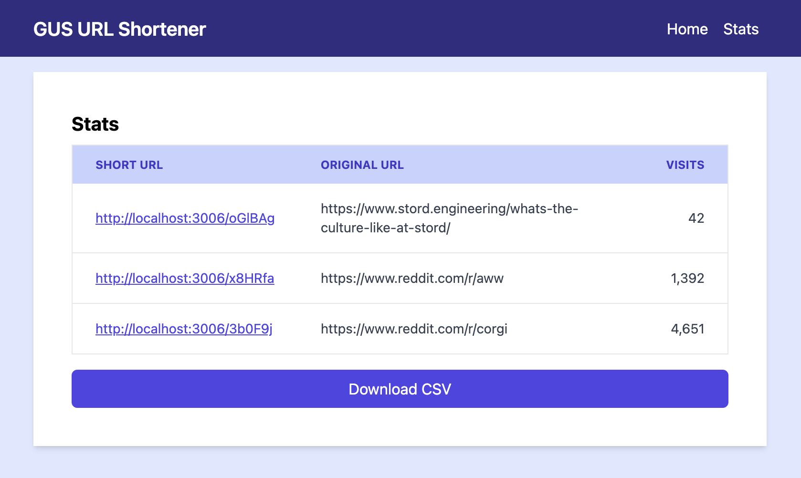

# GUS URL Shortener - Web UI

This project is a React application written in TypeScript and uses Tailwind CSS for styling. It uses Vite to build the project and uses its dev server to run the project locally in preview mode. Tests are written using the Vitest framework along with Testing Library for React and JSDom. Other libraries used in this project include [React Hook Form](https://github.com/react-hook-form/react-hook-form), and React Router.

## Getting Started

See the [README](../README.md) in the root of the project for instructions on how to get the project up and running.

## Usage

### Creating a Shortened URL

Once the project is running, open a browser to [http://localhost:3006](http://localhost:3006). You will see a form that allows you to enter a URL to shorten. The form will validate the URL to ensure that it starts with `http://` or `https://` and that it contains a domain. It will also check if the URL appears to already be shortened, and if so, it will not shorten it again.

Once you enter a valid URL, click the `Shorten` button. The form will switch to `copy` mode, and the shortened URL will be displayed in the form. You can click the `Copy` button to copy the shortened URL to the clipboard.

Once the URL has been copied, you can open it in the browser and it should automatically redirect you to the original URL.

### Viewing the Statistics

This project also provides a view of the shortened URLs and the number of times each URL has been visited. You can click on the `Stats` link in the header to view the analytics page.

Users can also download a CSV with the data in the table from this page.
